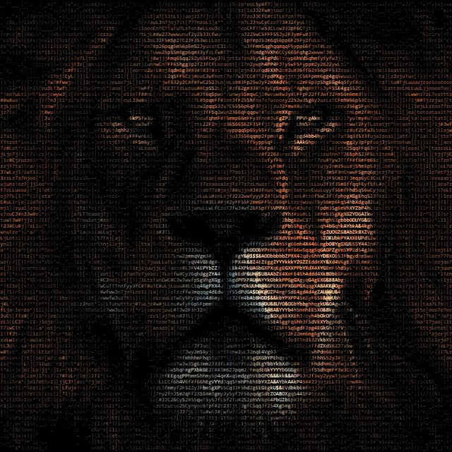
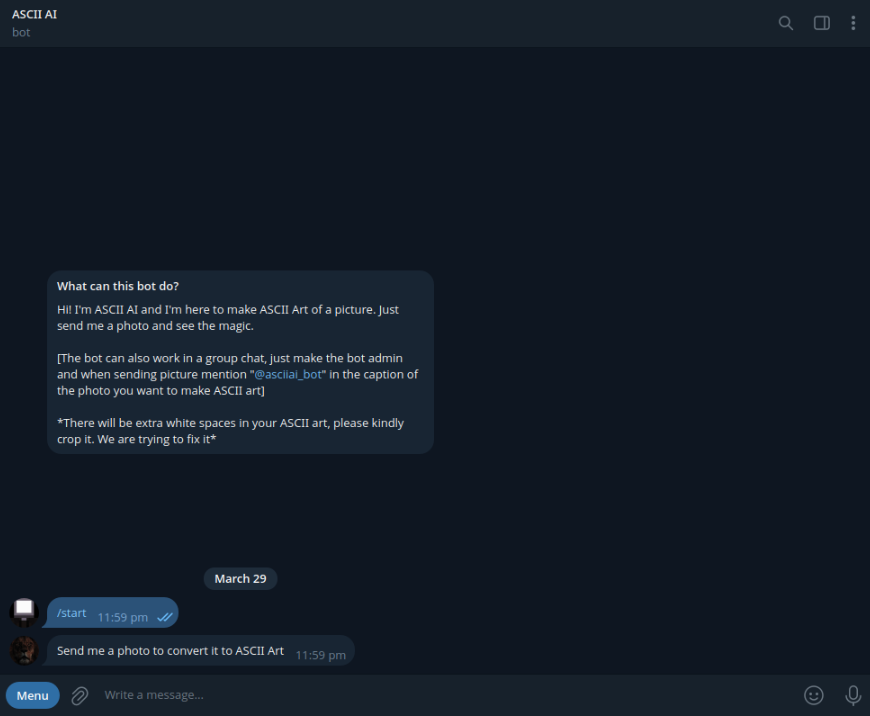
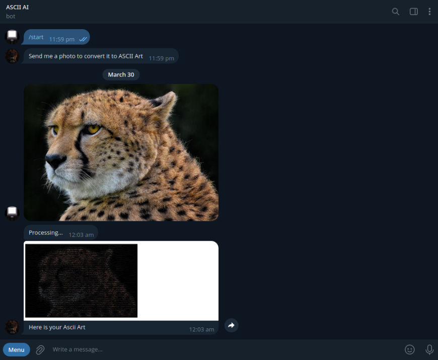

# 🎨 ASCII AI - Telegram Bot  



🚀 **Convert any image into ASCII art instantly!**  
A powerful Telegram bot built with **Python** that transforms images into ASCII masterpieces.  

[](https://t.me/asciiai_bot)  
[](LICENSE)  
[](https://www.python.org/)  

## 📌 Features
✅ Upload an image, get ASCII art instantly!  
✅ Fast & efficient image processing  
✅ Supports multiple image formats  
✅ Open-source & free to use  

## 🛠 Installation
Clone the repository and install dependencies:
```bash
# Clone the repo
git clone https://github.com/Sattik-Tarafder/AsciiAi_Telegram_Bot.git
cd AsciiAi_Telegram_Bot

# Install dependencies
pip install -r requirements.txt
```

## 🚀 Usage
1. **Start the bot** by running:
   ```bash
   python main.py
   ```
2. Open Telegram and search for **[@asciiai_bot](https://t.me/asciiai_bot)**
3. Upload an image & get ASCII art! 🎨

## 📸 Example
> 🖼 **Before:**  
>   

> 🎨 **After (ASCII Art):**  
>   

## 🤝 Contributing
Want to improve ASCII AI? Feel free to fork and submit a pull request! 🚀  

## 📜 License
This project is licensed under the **AGPL-3.0 License**. See the [LICENSE](LICENSE) file for details.
